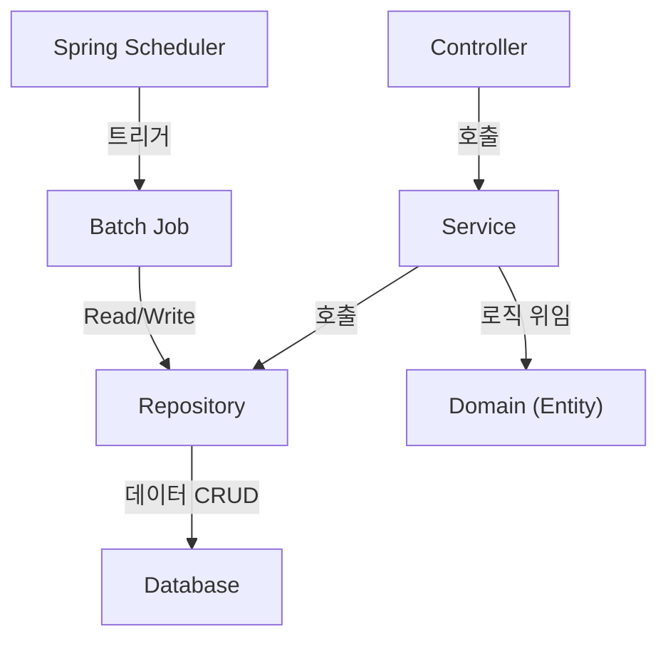

# 보험 계약 유지 관리 시스템 (Insurance Contract Maintenance System)

실무 생명보험사 계약 유지 시스템의 도메인 지식을 바탕으로, Spring Boot와 JPA를 활용하여 구축하는 백엔드 토이 프로젝트입니다.

## 📌 프로젝트 목표

-   복잡한 보험 도메인(고객, 계약, 특약, 납입, 실효/해지)을 객체지향적으로 모델링하고 JPA 엔티티로 설계하는 능력 배양
-   계층형 아키텍처(Controller, Service, Repository, Domain) 기반으로 각 계층의 역할과 책임을 명확히 분리하여 설계하는 실무 경험 습득
-   실시간 API 처리(PART 1)와 대용량 데이터 처리(PART 2)를 모두 구현하여 견고한 백엔드 시스템 구축
-   '살아있는' 도메인 모델과 테스트 코드의 중요성을 이해하고, 유지보수성과 확장성이 높은 코드를 작성하는 훈련

## 🚀 기술 스택 (Tech Stack)

| 구분 | 기술 |
| :--- | :--- |
| **Backend** | `Java 17`, `Spring Boot 3.x`, `Spring Data JPA`, `Spring Batch` |
| **Database** | `H2 Database` (TCP Mode) |
| **Build Tool** | `Gradle` |
| **Utilities** | `Lombok`, `Spring Boot DevTools` |
| **Test** | `JUnit5` |

## 🏛️ 아키텍처 및 설계 원칙

본 프로젝트는 아래 5가지 **설계 헌법**을 철저히 준수하여 개발됩니다.

#### 1. 핵심 컴포넌트 관계도 (역할 중심)



#### 2. 설계 헌법 5개 조항
1.  **도메인 모델 패턴:** 엔티티(`@Entity`)는 데이터와 핵심 비즈니스 로직(행위)을 함께 가지는 '살아있는 전문가' 객체여야 합니다.
2.  **정적 팩토리 메소드:** 엔티티 생성의 책임과 절차는 엔티티 자신이 `create...()`와 같은 표준화된 메소드를 통해 수행합니다.
3.  **연관관계 원칙:** 관계의 주인은 N쪽이며, 양방향 관계는 꼭 필요할 때만 연관관계 편의 메소드와 함께 설정합니다.
4.  **지연 로딩 우선:** 모든 연관관계는 `FetchType.LAZY`를 기본으로 하여 성능을 확보합니다.
5.  **테스트 코드 필수:** 모든 비즈니스 로직은 테스트 코드로 검증합니다.

## 📝 기능 명세서

### PART 1. 사용자/상담원용 웹 화면 기능 (API)

-   **[F-01] 고객 목록 조회 & 검색**
-   **[F-02] 고객 상세 조회** (보유 계약 목록 포함)
-   **[F-03] 계약 목록 조회 & 검색**
-   **[F-04] 계약 상세 통합 조회** (특약, 납입, 실효/해지 정보 포함)

#### API 엔드포인트 맵

| **HTTP Method** | **URL** | **담당 Controller** | **설명** |
| :--- | :--- | :--- | :--- |
| `GET` | `/api/customers` | `CustomerController` | 전체 고객 목록을 조회 |
| `GET` | `/api/customers/{id}` | `CustomerController` | 특정 고객의 상세 정보와 계약 목록을 조회 |
| `GET` | `/api/contracts` | `ContractController` | 전체 계약 목록을 조회 |
| `GET` | `/api/contracts/{id}` | `ContractController` | 특정 계약의 상세 정보를 통합 조회 |

### PART 2. 시스템/관리자용 백그라운드 기능 (Batch)

-   **[B-01] (배치)** 정상 납입 처리
-   **[B-02] (배치)** 실효 예고 및 최종 실효 처리
-   **[B-03] (배치)** 해지 안내 통지
-   **[B-04] (배치)** 자동 해지 처리

## 📁 프로젝트 구조 (Folder Structure)

```text
com.insurance.maintenance
├── 📁 controller/         # API Endpoints
│   ├── 📄 CustomerController.java
│   └── 📄 ContractController.java
├── 📁 service/             # Business Logic Orchestration
│   ├── 📄 CustomerService.java
│   └── 📄 ContractService.java
├── 📁 repository/          # Data Access Layer
│   ├── 📄 CustomerRepository.java
│   └── 📄 ContractRepository.java
├── 📁 domain/              # Core Business Entities & Logic
│   ├── 📄 Customer.java
│   ├── 📄 Contract.java
│   ├── 📄 Rider.java
│   ├── 📄 Payment.java
│   └── ... (LapseDetail, etc.)
├── 📁 dto/                 # Data Transfer Objects
│   └── 📁 response/
│       ├── 📄 CustomerResponseDto.java
│       └── 📄 ContractResponseDto.java
└── 📁 batch/               # Spring Batch Job Configurations
    └── 📄 LapseContractJobConfig.java
```

## ⚙️ 실행 방법

1.  **JDK 17** 및 **Gradle** 설치
2.  프로젝트 클론
    ```bash
    git clone [저장소 URL]
    ```
3.  프로젝트 빌드
    ```bash
    ./gradlew build
    ```
4.  애플리케이션 실행
    ```bash
    java -jar build/libs/maintenance-0.0.1-SNAPSHOT.jar
    ```
5.  H2 데이터베이스 콘솔 접속
    -   브라우저에서 `http://localhost:8080/h2-console` 로 접속
    -   JDBC URL: `jdbc:h2:tcp://localhost/~/maintenance` (yml 설정과 동일하게)
    -   사용자명: `sa`
    -   연결 후 테이블 생성 여부 확인
